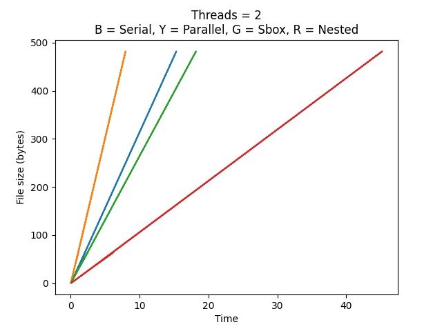

# Parallel implementation of 3DES

Encryption algorithms play an important role in today’s digital world. Large
amount of sensitive information is transferred over the unsecured internet every
day. Encryption algorithms are used to protect this information traveling through
the internet. The speed of encryption operations are also becoming important as
more people are using digital services for faster and protected transactions. In this
project we implement one such encryption algorithm – called 3DES -- through
openMP which parallelizes different parts of algorithm to achieve maximum
speedup.

# Background

3DES (Triple DES/ Triple Data Encryption Standard) is a cryptographic
algorithm which is based on symmetric-key block cipher. It applies DES cipher
three times to every block. 3DES was first published in 1995. The structure of the
3DES is based on Feistel networks.

# Workings of DES
## Key Generation
<ul>
<li>The 64-bit key is permuted to 56 bits using the permutation combination 1
(see constants.h) matrix. So 57th bit of the original key is mapped to the 1 st
bit of the permuted key.</li>
<li>The original 56 bit key is divided into two halves of 28 bits each.</li>
<li>Each matrix is then left shifted using bit rotation (bitRot in constants.h)
matrix for each round (16 rounds)</li>
<li>The output is the fed to permutation combination 2 which outputs 48 bits.</li>
<li>The algorithm is run three times for every key (3 keys) to finally get 3DES
encrypteed output (cipher text)</li>
</ul>

## Encryption/Decryption

<ul>
<li>64-bit is divided into two arrays of 32 bits each (left and
right).</li>
<li>There are 16 round for each block of plaintext. Because DES is based on
feistel cipher.</li>
<li>Right 32 bits are permuted to 48 bits with Expansion box array.</li>
<li>The bits at the left half are simply fed to XOR function but the bits at the
right half go through a function (process) before being XORed with left half
bits.</li>
<li>The round keys generated from original keys are fed to the function and
right half of the text as well.</li>
<li>The function then uses expansion box to expand the 32 bit input to 48 bits
which are then passed through S-boxes (sBox in constants.h) to reduce the
48 bits to 32 bits again.</li>
<li>The S-boxes (substitution boxes) provide diffusion/Avalanche effect to the
input so that a slight change in the input causes big change in the cipher
text (output). There are a total of 8 S-boxes.</li>
<li> The Sbox works as follows:
-> For example: S1(37) = ?
-> 37 = 100101 so middle 0010
can be searched in column of
sbox and 11 right most and
left most bits which make 11
in the row of sbox. If we find
0010 and 11 in sbox we get
1000 output. (constants.h
contains Sbox table in decimal)
</li>
<li>The output is then XORed
with the left half of the text
and fed to right half of the
next round and right 32 bits
are also fed to left half of
next round.</li>
<li>This process continues for 16 round </li>
<li>The IP inverse (ipInv in constants.h) is applied to the output and it becomes
the cipher text.</li>
<li>The same process is applied to the Cipher text to get the original plain text
but only the round keys are applied in reversed fashion. The round 16 key is
applied to first round, 15 to 2nd and so on.</li>
<li>Initial Permutation and Final Permutation (IP and IP -1)
</li>
</ul>

<center>C = E<sub>K3</sub>(D<sub>K2</sub>(E<sub>K1</sub>(P)))</center>
<center>P = D<sub>K1</sub>(E<sub>K2</sub>(D<sub>K3</sub>(C)))
</center>

# Parallelization

## Parallelizing the Encryption/Decryption region:

In 3DES data is split into blocks of 64 bits each which are then fed to
Encryption/Decryption function with the 56 bits round keys. We have added
parallel region here so that each thread gets 64bits data and a round key and
computes the output seperately. This implementation gives far more speed up
than the other implementation.

## Parallelizing SBOX operations:

In 3DES data is passed through sbox or substitution boxes to add the
element of diffusion. 48 bits of data coming from expansion boxes is passed to
sbox in blocks of 6 each. Middle 4 bits map the sbox column and adjacent 2 bits
map the row of sbox. We have added parallel region here to make the operations
efficient but somehow it becomes slower as the data grows because of the thread
creation overhead.

## Nested Parallelism:

We have merged the parallelism of sboxes with encryption/decryption function
and enabled nested parallelism as well. Again in this case, we are not getting the
speed up for large files because of the thread creation overhead.

# Tools and Dependencies
1. C++
2. Python 2.x/3.x
3. Matplotlib C++ API

# Compiling
&emsp; ```https://github.com/IAMIQBAL/3DES-Parallel-OpenMP.git```
<br>
&emsp; ```cd 3DES-Parallel-OpenMP```
<br>
&emsp; ```g++ -o main -fopenmp main.cpp```
<br>
&emsp; ```./main```

# Tests/Graphs

## Using 2 Threads
<br>

<br>

## Using 4 Threads
<br>

<br>

## Using 8 Threads
<br>


## Serial VS Parallel 8 Threads (Y = Parallel, B = Serial)
<br>


<br>
<br>
<br>